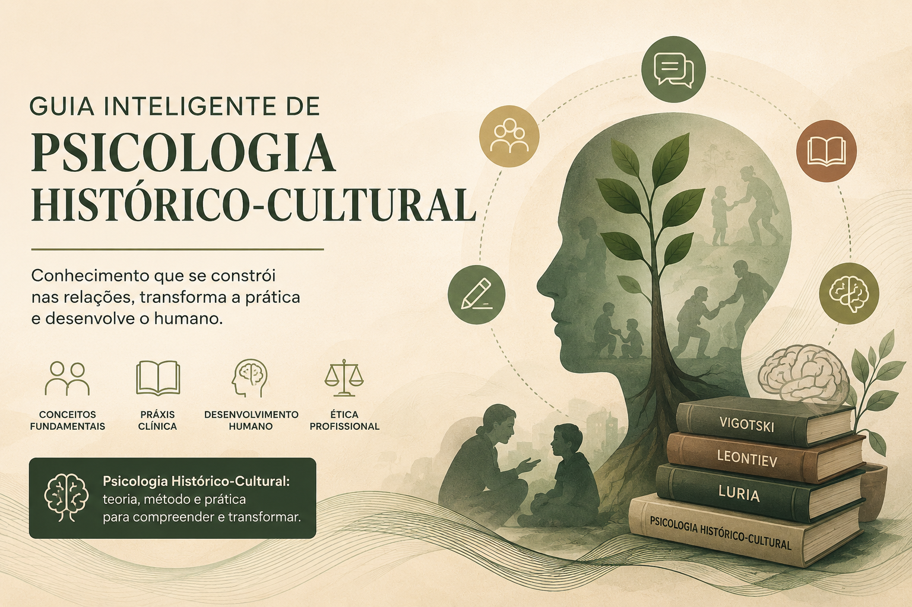

# 🧠 Guia Inteligente de Psicologia Histórico-Cultural

## 📖 Sobre o projeto

Este projeto foi desenvolvido como parte do desafio **"Criando um Caderno Temático com NotebookLM"** da DIO.

O objetivo foi construir uma base de conhecimento especializada sobre **Psicologia Histórico-Cultural**, utilizando o NotebookLM como ferramenta de aprendizagem ativa. Para isso, foi realizada uma curadoria de fontes acadêmicas e normativas que permitem compreender os fundamentos teóricos da abordagem, suas aplicações clínicas e os princípios éticos que orientam a atuação profissional do psicólogo.

Diferentemente de um chatbot genérico, este NotebookLM foi configurado para responder utilizando exclusivamente as fontes selecionadas, permitindo consultas fundamentadas, resumos, comparações entre autores, geração de materiais de estudo e apoio à revisão de conteúdos acadêmicos.

---

## 🎯 Objetivos

Este caderno temático foi desenvolvido com os seguintes objetivos:

* Consolidar conhecimentos sobre a Psicologia Histórico-Cultural;
* Centralizar referências acadêmicas em um único ambiente de consulta;
* Explorar o potencial do NotebookLM como ferramenta de aprendizagem baseada em documentos;
* Produzir resumos e materiais de revisão apoiados por Inteligência Artificial;
* Avaliar a qualidade das respostas geradas a partir de diferentes estratégias de prompting;
* Desenvolver um material reutilizável para estudos futuros e apoio à prática acadêmica.

---

## 🛠️ Tecnologias Utilizadas

* NotebookLM
* Inteligência Artificial Generativa (Google Gemini)
* GitHub
* Markdown

